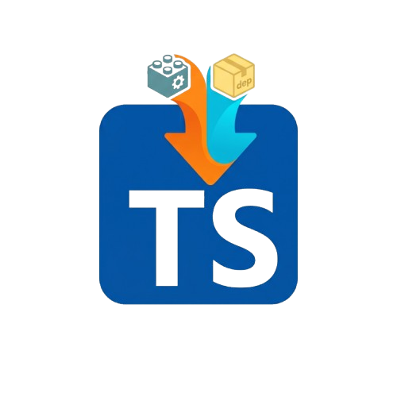

  
  <h1 style="text-align: center; font-weight: bold;">Inject.d.ts</h1>

Inject.d.ts provides global TypeScript declaration packages directly, eliminating the need to `install them separately` in each workspace/project.

Available on:
- [Open VSX](https://open-vsx.org/extension/KristanLaimon/inject-d-ts)
- [Visual Studio Marketplace](https://marketplace.visualstudio.com/items?itemName=KristanLaimon.inject-d-ts)

## Usage

1. Install and enable the extension.
2. Open any TypeScript or JavaScript file.
3. Use the **Inject.d.ts** activity bar icon to inspect bundled and downloaded declaration packages.
4. Run **Download Types Package** from the view title or command palette to add a package such as `@types/lodash`, `@types/express`, or `@types/bun@latest`, or anything you want to load globally!
5. Expand a package item to read its `.d.ts` files, use **Change Types Package Version** to install a different version, or **Delete Types Package** to remove downloaded packages and hide bundled packages.

  

_Demo: Installing @types/bun for script usage without needing to `npm install` it and no /node_modules_

## Why?
Sometimes I wanted to do small scripts using Typescript but intelissense stops working due to the lack of any "@type/#" installed with npm (or you preffered package manaer), being annoying when doing vanilla scripts. So I had to do my scripts in .js, vscode for some reason provides node.js intelissense inside .js.

Do we need to npm install typescript types ".d.ts" everytime we wanna use `Typescript` for simple scripts!?? Not anymore.

> 🟢 Important: This is for only vscode-compatible editor's intelissense, doesn't validate in run-time...

## Features

- Bundles `@types/node` by default.
- Injects declaration files through a TypeScript server plugin, so IntelliSense can see them in projects and loose files.
- Adds an activity bar view named **Inject.d.ts** with a **Global Types** package list.
- Downloads additional npm type packages into extension global storage.
- Supports create, read, version changes, and delete for downloaded and bundled packages.
- Does not modify the current workspace or run `npm install` / `pnpm install` inside your projects.

## Notes

- Downloading packages requires network access to the npm registry.
- This is for **editor IntelliSense and type checking inside VS Code-compatible editors**. _It does not change runtime behavior_.
- Project-local `tsconfig.json` settings can still affect how TypeScript reports conflicts between DOM, Node, Bun, and other global declarations.
